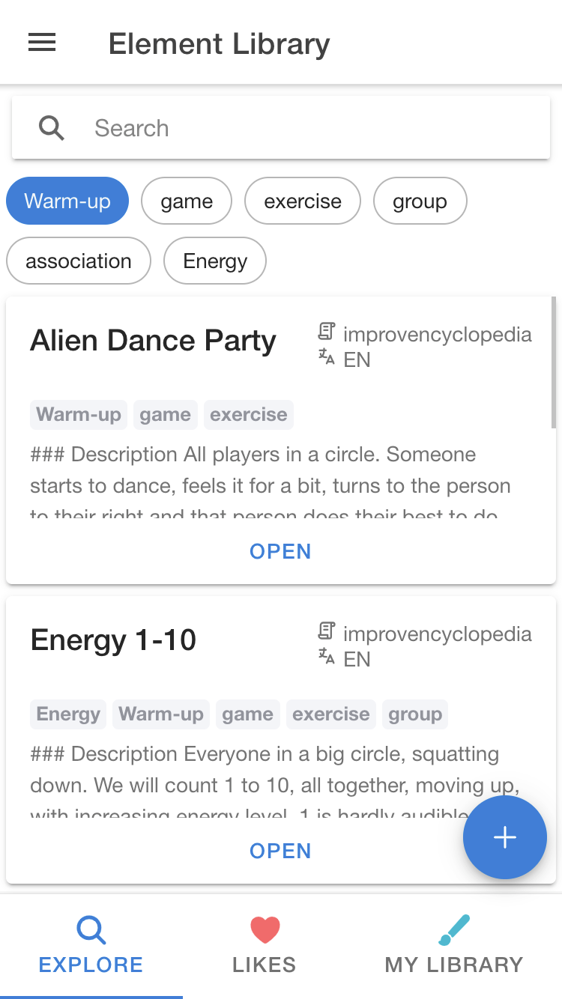
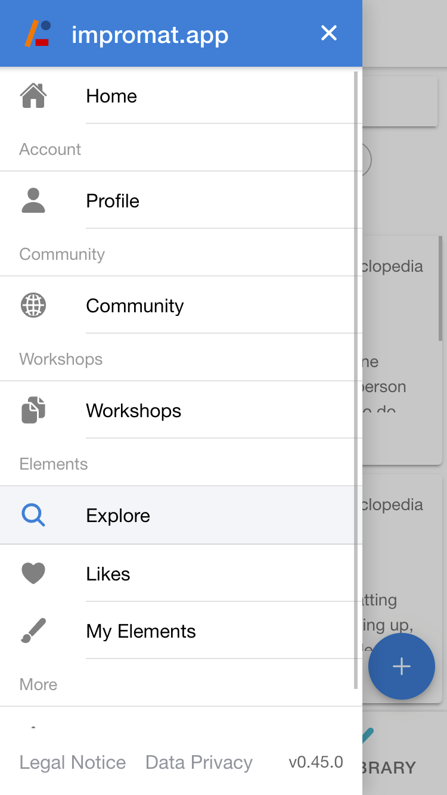

<!-- Motivation & Background -->

To collect information about user behavior, I observed individuals using [Impromat.app](https://impromat.app). Quickly, I noticed, that one issue was the navigation. For instance, users were not clicking on the drawer icon located in the top-right corner in order to view all functions of the app (such as the ability to search for improv exercises and games, build a personal workshop, or manage individual exercises and games). Even worse, some mobile devices have a native feature that navigates back when swiping from left to right. This made it extremely difficult to navigate the app, as users were unable to open the drawer.

<!-- Problem Summary -->

So, I sought a solution to improve the discoverability of [Impromat.app](https://impromat.app) and enable swiping from left to right to open a drawer on devices lacking the option. Below is a screenshot of the elements page which allows improvisers to search existing elements and exercises.

<figure>
  
  <figcaption>The screen displays Elements for searching exercises and games.  The app's other features are concealed in the drawer (refer to below), which may lead users to believe that only "exploration," "liking," or "my library" are possible actions.</figcaption>
</figure>

However, clicking on the drawer icon on the top right reveals the full functionality of the app.

<figure>
  
  <figcaption>Open drawer that shows all available sub-pages. Please note that the search function is only one of its components.</figcaption>
</figure>

<!-- Possible Solutions -->

## The Navigation Bar Solution

Initially, I had considered dropping web app support and exclusively backing the locally installed application to avoid browser incompatibilities. However, this solution would not resolve the app's discoverability.

Therefore, I researched other frameworks and applications and discovered the top-level navigation of tabs, which are utilized by apps such as Spotify and Google Play store.

The Material 3 design offers [helpful documentation on its website](https://m3.material.io/foundations/layout/applying-layout/compact#f328a230-8f35-4b54-adca-be4acc42fa25). According to their suggestions, a bottom tabs navigation (referred to as a "navigation bar") is suitable for compact screens, while a side bar navigation is better for larger screens.

Given the mobile-centric approach of [Impromat](https://impromat.app), the bottom navigation bar with tabs is an appropriate starting point. Here is a preliminary version of the bottom navigation bar:

<figure>
  <!--  -->
  
  <figcaption>Impromat with a navigation bar to reveal more functions and simplify user interaction.</figcaption>
</figure>

Sections are divided into the three main areas:

1. **Home**: About information, news, profile, settings, legal notice, data privacy, etc.
2. **Exercises & Games**: Search improvisational theater elements that you can add to workshops and manage your own entries.
3. **Workshops**: Plan and share your improv workshops.

## Wrap-up

The implementation of the new navigation approach is currently under development, but I already like it a lot for its easy app discoverability, conciseness, and ease of use (just one click instead of a swipe gesture). However, I am still determining the optimal high-level differentiation, which will depend on users' goals when they open [Impromat](https://impromat.app).

In the future, I will integrate a more adaptive design following the guidelines of Material Design [source](https://m3.material.io/foundations/layout/applying-layout). Currently, I must assess whether implementing these changes will enhance the user experience before proceeding.