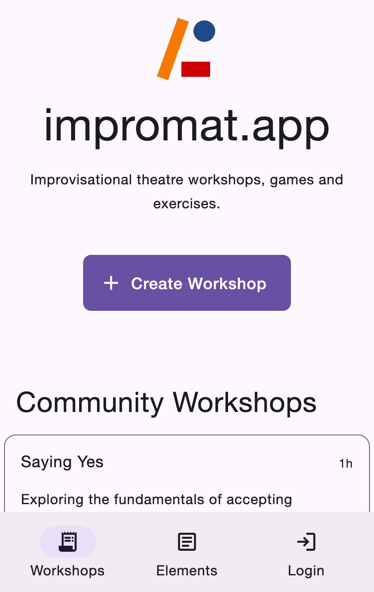

I am sitting in front of my paper based notebook. My shiny improvisational theatre notes stare at me. It's time again to jot down thoughts as I signed up to lead our next session. I am opening a blank page.

A goal.

"I need a goal for my workshop", I think.

Something about group mind? Building characters? Emotions?

"I need some games".

It's always the same.

"I am a bloody software engineer. I can make this process more efficient".

...

Three years pass and I am ready to introduce:

[impromat.app](https://impromat.app/?campaign=blog) - _dead simple improvisational theatre planning._

<figure>
  
  <figcaption>Create Improv Sessions with <a href="https://impromat.app/?campaign=blog">impromat.app</a></figcaption>
</figure>

## Why an Improv app?

In most improv groups, one person facilitates an improv session. That person is responsible for providing structure, exercises, games and in rare cases, fun.

There is books on improv. There exist encyclopedias like improwiki, improvencyclopedia, improvressourcecenter. Improv groups posses knowledge and unique styles. Most of that are individual games and exercises that exist to have fun. They are labelled sometimes. For example, the improwiki website assigns tags to their elements. That eases the search for warmup, exercises, or games.

**When you ultimately prepare and run an improv session you are lacking tools.**

I formed a new improv group and ran sessions on "how to do an improv workshop" to allow participants the facilitation. I run these sessions very spontaneously because there are many games and exercises that I know and that I can put into the workshop. That spontaneous setup makes it hard for me to pass on that knowledge or at least the games that we play.

And how do you seek inspiration for you improv group? You have your known set of games, but how do you get new ideas? You could participate in external workshops, or hire an external workshop leader. You could read books, or browse some of the online sources.

Guess what. There is a solution to all of these problems: Impromat.

Impromat inspires you with unique and new games. Impromat provides you with a dead simple planning tool that allows you to plan and share workshops with participants or the community.

### Introducing Impromat

Known improv sites like, Improwiki, improvencyclopedia or improvresourcenter served as the initial content for my personal planning. I soon began developing a small application around it to make the planning of workshops more efficent. Then, I opened it up for everyone to use.

There is no good way right now to have a good improv session planning tool available that covers improvisational theatre. Most people use Excel or their personal notes.

Moreover, there is no easy approach in sharing improv workshops to inspire others.

Impromat brings these two aspects together: getting inspiration through other sessions -> planning a new session -> inspire other sessions -> planning a new session...

Of course, everyone has their private space. You don't have to share what you don't want to share.

#### So, what the heck is it, how is it build?

Elements and collections are in the core of the application. Elements are exercises or games like Freeze Tag, Dutch Triangle, Association Circle, and so on. Collections contain elements in certain orders like workshops. They contain elements that an improv leader goes through in the course of the session.

Elements are tagged to make your life easier with finding suitable ones. If you plan a workshop around character building you could filter all elements by the _character_ tag. Elements are the smallest set of information to describe an activity that the group or individuals can perform.

Currently, there is the concept of workshops, e.g. sessions that you will actually lead in an improv group. But you can also see workshops like playlists and the elements like songs and create collections of elements that fit to your planned show format around the meaning of life.

#### How can I use it?

You can access Impromat on any device with a browser. It supports mobile and desktop layouts so you can dive into improv when procrastinating other important work on your PC, sitting in the bus or walking unprepared into the room where you should lead the next improv session.

Over 1000 fun and boring improv elements are waiting to be opened on [Impromat Elements](https://impromat.app/elements?campaign=blog). Browse them, search them, give them a pet. If you like them, they like you. If you don't like them, you have the power to make them better, or pick another one.

For planning your workshops you can start with [Creating a Workshop](https://impromat.app/workshops/create?campaign=blog). Here you can use our improv workshop generation engine or start with a plain collection to fill in your ideas.

Use your private space to start with your creation. Contribute to the improv community by publishing your workshop so improvisers can use your inspiration.

## Future

There is some stuff planned down the road. But like a road is first just a path of gravel, Impromat is in its first iteration. Join to make Impromat an Autobahn:

If you are an improviser, give it a shot.

If you are no improviser, give it a shot.

If you have an opinion, share your thoughts and ideas.

If you want to develop, join with some coding.

If you want to be a tree, give it at shot.

If you just landed here and don't know why, give it a shot.

If you feel frustrated, happy or hungry, give it a shot.

Let us have some fun.

[impromat.app](https://impromat.app?campaign=blog)
