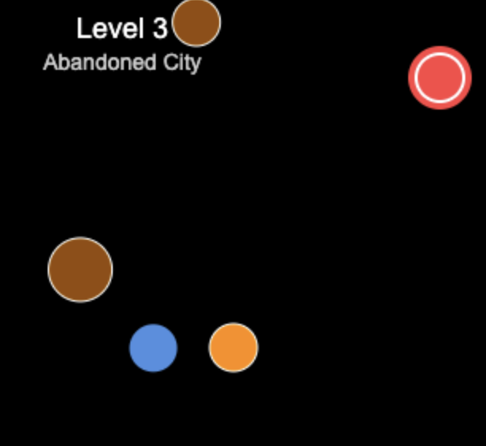

<figure>
  
  <figcaption>AI generated blobs in the game</figcaption>
</figure>

I recently built a proof of concept to experiment with large language models inside games, using a locally running LLM to generate dynamic content in real-time. The goal was to create a unique gaming experience where the game evolves based on player actions, with each level featuring procedurally generated content that responds to gameplay.

You can find the complete implementation in the [llm-game repository](https://github.com/marcoklein/llm-game).

## The Core Challenge: Constraining Creativity

The fundamental challenge with integrating LLMs into games is finding the right balance between creative freedom and system stability. You need to constrain the AI within a specific frame so that a small, locally running LLM can generate content without breaking the game mechanics.

However, this constraint comes with a significant downside: reduced creativity. In my implementation, I limited all entities to circles to simplify collision detection and positioning logic. While this made the system robust, it also made the generated content somewhat monotonous - everything was just circles with different colors and sizes.

If I would loosen it up too much, I run in the risk of the LLM hallucinating or producing wrong code which would mitigate the player experience.

## How the System Works

The core game is limited to a Player, that is controlled with arrow keys, a target that the player has to reach and LLM-generated NPCs. When the player reaches the target the game generates a new NPC and thus gradually generating more and more game content.

For each level, the system generates one or more NPCs with properties. The interface is limited, to reduce errors with the usage of the small LLM. The `behaviorCode` is the only generated property that the game engine executes.

```typescript
interface NPCData {
  position: { x: number; y: number };
  color: string;
  size: number;
  behaviorCode?: string;
}
```

Behavior code wrapped into a TypeScript template and directly executed:

```ts
return function(npc, context, deltaTime) {
    try {
        ${code} // LLM generated code is added here
    } catch (e) {
        console.warn('AI behavior error:', e);
    }
};
```

This function is executed every update, giving the LLM access to the npc, context, and deltaTime variables.

## Conclusion

Entity constraints (like only drawing circles), while necessary for system stability, severely limited visual variety and variety in behaviors. Everything generated was fundamentally the same shape, just with different colors and sizes. Those generations could have been done by a simpler generation algorithm. Next time, I would thus explore more fields where LLMs would really excel (like text and story generation).

For me, the experiment reinforced that successful AI integration requires careful architectural decisions and robust fallback systems. The idea shows promise, but finding the right balance between creative freedom and constraints is challenging.
